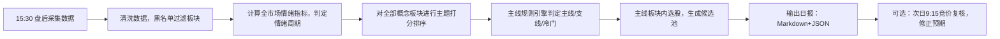

# A股主线&主题自动化识别系统设计方案
> 目标：通过公开API采集数据，量化市场情绪、自动打分题材板块，识别当前市场主线/支线主题，为短线交易选股提供客观参考。
> ⚠️ 风险提示：本系统仅为量化复盘辅助工具，**不构成任何投资建议**；A股行情存在突发消息、资金博弈、监管扰动，自动化模型存在误判概率，实盘必须人工复核。

## 1. 核心概念定义
- **主题**：市场资金集中炒作的题材方向（如AI、低空经济、新能源）。
- **主线**：众多主题中，**持续性最强、资金最集中、赚钱效应最好**的核心题材，主导一段阶段行情。
> 交易原则：优先跟随主线，减少冷门支线参与，提升交易胜率。

## 2. 系统整体架构（四层流水线）
```
L0 数据采集层 → L1 市场环境&情绪周期层 → L2 主题强度打分层 → L3 主线判定层 → L4 主线选股映射层
```

### 2.1 L0 数据采集层
> 数据源全部为公开零鉴权接口，无需申请token，盘后采集。

| 数据类型 | 接口来源 | 核心字段 |
| ---- | ---- | ---- |
| 概念板块列表与行情 | 东方财富 push2 | f3板块涨幅，f6成交额，f128领涨股 |
| 涨停池、连板信息 | 东方财富push2ex涨停接口 | 连板数、首封时间、封单、个股所属题材 |
| 炸板池 | 东方财富push2ex炸板接口 | 炸板个股、炸板时间 |
| 昨日涨停板块 BK0815 | 东方财富概念接口 | 昨日涨停股今日平均溢价（赚钱效应） |
| 大盘指数、两市成交额 | 腾讯财经行情接口 | 指数涨跌幅、全市场成交总量 |
| 概念板块成分股 | 东方财富板块成分接口 | 用于计算板块内涨停密度 |
| 新闻催化（可选增强） | 财联社电报、涨停原因文本 | 题材事件归因（非必须，属于附加模块） |

> 接口容错：主域名失败自动切换备用delay域名，防止网络波动采集中断。

### 2.2 L1 市场环境&情绪周期层
**作用：先判断大盘整体情绪，情绪差时即使题材很强，也要降低仓位预期。**

#### 情绪指标阈值表
| 指标 | 强情绪 | 中性 | 弱/冰点 | 数据来源 |
|---|---|---|---|---|
| 涨停家数 | >60（≥80狂热） | 30~60 | <30 | 涨停池 |
| 跌停家数 | <5 | 5~15 | ≥15 | 全市场扫描 |
| 市场最高连板高度 | ≥5板 | 3~4板 | ≤2板 | 涨停池连板字段 |
| 炸板率 | <25% | 25%~40% | >40% | 炸板数 /（涨停+炸板） |
| 连板晋级率 | >50% | 35%~50% | <35% | 昨日连板今日成功晋级数量 |
| 昨日涨停溢价 | >+3% | 0 ~ +3% | <0 | BK0815板块涨跌幅 |
| 涨跌家数比 | >2 | 0.5~2 | <0.5 | 全市场涨跌统计 |

#### 情绪周期状态机（优先级从高到低）
1. **冰点期**：跌停≥15，涨停＜30，高标≤2板；操作建议：空仓等待新题材拐点
2. **启动期**：涨停数量回暖，出现新龙头，温和放量；操作建议：小仓位试错
3. **发酵期**：连板高度≥5，涨停40~120，晋级率上行，主线成型；操作建议：重仓主线
4. **高潮期**：涨停≥80，炸板率＜25%，市场全面亢奋；操作建议：边打边撤，逐步止盈
5. **退潮期**：涨停环比大幅下滑，晋级率＜35%，炸板率走高，高标断板；操作建议：降仓、观望，不追高

> ✅ 关键规则：**必须使用环比数据**，单日截面数据容易误判；对比前一日涨停数量、晋级率。

### 2.3 L2 主题强度打分模型
> 对所有概念板块进行归一化加权打分，筛选市场热点主题。

#### 权重分配（归一化后加权求和，总分0~100）
| 维度 | 权重 | 计算规则 |
| ---- | ---- | ---- |
| 板块当日涨幅 | 30% | 当日全市场板块涨幅分位 |
| 板块成交额 | 30% | 板块成交额在全板块的分位，衡量资金体量 |
| 涨停密度 | 25% | 板块成分股中涨停数量（封顶5家计满分） |
| 领涨股强度 | 15% | 板块龙头连板高度、封单强度 |

> 预处理过滤规则：
> 1. 候选池 = 涨幅前45 ∪ 成交额前45 的板块
> 2. 黑名单剔除：宽基指数、融资融券、基金重仓、昨日涨停等非题材板块，避免污染结果

### 2.4 L3 主线判定规则（从主题中识别主线）
> 满足全部条件，判定为主线；满足部分判定为支线；其余为冷门题材。

主线判定条件：
1. 板块综合强度分 ≥ max(60, 第一名板块分数 × 0.8)，板块当日收涨且板块涨停≥2家
2. 资金集中：板块成交额处于全市场前20%
3. 梯队完整：板块同时存在**连板龙头 + 首板个股**（题材梯队，说明资金分层，不是单个个股独立行情）
4. 情绪适配：退潮/冰点期主线降级，降低操作权重；发酵/高潮期主线权重拉满

分类结果：
- ✅ **主线**：跟随为主，优先选股方向
- ⚠️ **支线**：观察，小仓位博弈，不作为核心方向
- ❌ **冷门**：不参与

### 2.5 L4 主线选股映射层（主线板块 → 候选个股）
拿到主线板块后，在板块内划分三类标的，同时叠加风控过滤：
1. **龙头**：板块内最高连板、封单强、首封时间最早
2. **卡位标的**：板块内细分分支，接力备选
3. **低位补涨**：主线板块内低位、放量，尚未大幅拉升的个股

风控过滤（自动剔除）：
ST股、退市预警、极小市值、前期巨大高位股、存在公开重大利空个股。

## 3. 自动化调度流程


调度计划：
- 工作日15:30收盘后自动采集
- 16:00 执行评分、情绪判定、主线识别
- 16:30 生成日报文件，可推送至通知渠道
- 可选：次日9:15集合竞价重新复核主线标的竞价强度

## 4. 系统输出日报字段
每日产出报告包含以下内容：
1. 市场情绪总览：涨停/跌停数量、炸板率、晋级率、最高连板、昨日涨停溢价、情绪周期结论 + 仓位建议
2. 全市场主题榜单：所有题材板块打分排序表
3. 主线列表、支线列表、冷门提示
4. 主线板块内候选股票池（龙头/卡位/补涨）
5. 当日操作提示（跟随主线/观望/试错等）

## 5. 系统边界与局限性（重点）
1. **模型基于历史资金统计**：突发政策、黑天鹅、盘中临时消息会直接改变主线，自动化系统无法预判突发催化，**人工复核不可缺少**。
2. 持续性需要历史时序数据：当前单日打分可以识别当日热点；真正主线必须连续多日高分，需要入库保存每日榜单，统计连续上榜次数。
3. 题材概念归属存在误差：个股同时归属多个概念板块，会造成涨停归属统计偏差。
4. 接口风险：东方财富公开接口为非官方开放API，接口字段、地址可能不定期变动，存在失效风险。
5. 回测偏差：量化指标只统计公开盘面数据，无法统计龙虎榜资金意图、盘口暗资金。

## 6. 扩展优化路线
1. 短期：完善L4选股模块，把龙头、卡位、补涨逻辑写入代码，直接输出个股清单。
2. 中期：搭建时序数据库，保存每日板块得分，增加**题材持续性打分（连续N日热度）**，强化主线判定。
3. 中期：接入新闻文本NLP模块，自动识别题材催化事件，区分是消息脉冲一日游题材还是产业逻辑主线。
4. 长期：增加龙虎榜资金、北向资金、板块资金流作为附加因子，优化评分模型。

## 7. 免责声明
> 本工具仅用于复盘、行情客观数据统计，**不构成任何投资建议**。股市存在风险，所有指标、主线判定结果仅为参考，交易决策请自行负责。

---

# 配套 Python 源码 `mainline_framework.py`
> 依赖：`requests`
```python
import requests
import json
import pandas as pd

# ===================== 配置参数区（可自行调参）=====================
BLACK_LIST_KEYWORDS = ["HS300", "中证", "融资融券", "昨日涨停", "基金重仓", "上证50"]
EMOTION_PARAM = {
    "hot_zt": 60,
    "crazy_zt": 80,
    "cold_zt": 30,
    "cold_limit_down":15,
    "high_board_hot":5,
    "high_board_cold":2,
    "zbr_hot":0.25,
    "zbr_cold":0.40,
    "jinji_hot":0.50,
    "jinji_cold":0.35
}
HEADERS = {
    "User-Agent": "Mozilla/5.0 (Windows NT 10.0; Win64; x64) AppleWebKit/537.36 (KHTML, like Gecko) Chrome/120.0.0.0 Safari/537.36"
}
# ==================================================================

def fetch_concept_list():
    url = "https://push2delay.eastmoney.com/api/qt/clist/get?fs=m:90+t:3&fields=f1,f2,f3,f6,f128,f104,f105"
    res = requests.get(url, headers=HEADERS, timeout=10)
    data = res.json()
    raw = data["data"]["diff"]
    concept_list = []
    for item in raw:
        name = item["f14"]
        # 黑名单过滤
        if any(k in name for k in BLACK_LIST_KEYWORDS):
            continue
        concept_list.append({
            "name":name,
            "change_pct": item["f3"],
            "amount": item["f6"],
            "lead_stock": item["f128"]
        })
    df = pd.DataFrame(concept_list)
    return df

def fetch_zt_pool():
    url = "https://push2ex.eastmoney.com/getTopicZTPool"
    r = requests.get(url, headers=HEADERS, timeout=10)
    j = r.json()
    zt_list = j["data"]["pool"]
    zt_df = pd.DataFrame(zt_list)
    return zt_df

def fetch_zb_pool():
    url = "https://push2ex.eastmoney.com/getTopicZBPool"
    r = requests.get(url, headers=HEADERS, timeout=10)
    j = r.json()
    zb_list = j["data"]["pool"]
    zb_df = pd.DataFrame(zb_list)
    return zb_df

def calc_emotion(zt_df, zb_df, prev_zt_cnt, prev_jinji_rate):
    zt_cnt = len(zt_df)
    zb_cnt = len(zb_df)
    zbr = zb_cnt/(zt_cnt + zb_cnt) if (zt_cnt+zb_cnt) >0 else 0
    max_board = zt_df["lbc"].max() if not zt_df.empty else 0
    # 情绪周期判定逻辑
    stage = "中性"
    if zt_cnt < EMOTION_PARAM["cold_zt"]:
        stage = "冰点期"
    elif prev_zt_cnt is not None and zt_cnt < prev_zt_cnt*0.7 and prev_jinji_rate < EMOTION_PARAM["jinji_cold"]:
        stage = "退潮期"
    elif zt_cnt >= EMOTION_PARAM["crazy_zt"] and zbr < EMOTION_PARAM["zbr_hot"]:
        stage = "高潮期"
    elif max_board >= EMOTION_PARAM["high_board_hot"] and zt_cnt >=40:
        stage = "发酵期"
    elif zt_cnt > EMOTION_PARAM["cold_zt"] and prev_zt_cnt is not None and zt_cnt>prev_zt_cnt:
        stage = "启动期"
    emo_info = {
        "zt_count": zt_cnt,
        "zb_count": zb_cnt,
        "zha_ban_rate": round(zbr,3),
        "max_board": max_board,
        "stage": stage
    }
    return emo_info

def score_concepts(concept_df):
    # 简易归一化打分示例
    from sklearn.preprocessing import MinMaxScaler
    scaler = MinMaxScaler()
    concept_df["norm_change"] = scaler.fit_transform(concept_df[["change_pct"]])
    concept_df["norm_amount"] = scaler.fit_transform(concept_df[["amount"]])
    # 简化涨停密度，此处可扩展：读取板块成分股统计涨停数量
    concept_df["zt_density"] = 0
    concept_df["leader_score"] = 0
    concept_df["total_score"] = (
        concept_df["norm_change"]*0.3
        + concept_df["norm_amount"]*0.3
        + concept_df["zt_density"]*0.25
        + concept_df["leader_score"]*0.15
    )*100
    res_df = concept_df.sort_values("total_score", ascending=False).reset_index(drop=True)
    return res_df

def find_main_line(scored_df):
    main_lines = []
    sub_lines = []
    top1_score = scored_df.iloc[0]["total_score"] if len(scored_df)>0 else 0
    for idx,row in scored_df.iterrows():
        s = row["total_score"]
        if s >= max(60, top1_score*0.8):
            main_lines.append({"name":row["name"],"score":round(s,2)})
        elif s >=40:
            sub_lines.append({"name":row["name"],"score":round(s,2)})
    return main_lines, sub_lines

def generate_markdown_report(emo, main_list, sub_list):
    md = f"""# A股主线主题每日复盘报告
## 市场情绪概况
- 涨停家数：{emo['zt_count']}
- 炸板数量：{emo['zb_count']}
- 炸板率：{emo['zha_ban_rate']:.2%}
- 市场最高连板：{emo['max_board']}板
- 当前情绪周期：**{emo['stage']}**

## 主线题材
"""
    for item in main_list:
        md += f"- {item['name']}  综合得分：{item['score']}\n"
    md += "\n## 支线题材\n"
    for item in sub_list:
        md += f"- {item['name']}  综合得分：{item['score']}\n"
    md += """
> 提示：主线为阶段最强题材，优先主线内选股；支线仅观察，冷门题材不参与。
> ⚠️ 本报告仅数据统计，**不构成任何投资建议**。
"""
    return md

if __name__ == "__main__":
    print("开始采集数据...")
    df_concept = fetch_concept_list()
    df_zt = fetch_zt_pool()
    df_zb = fetch_zb_pool()
    # 上一日数据需要历史库，首次运行置空
    emotion_info = calc_emotion(df_zt, df_zb, prev_zt_cnt=None, prev_jinji_rate=None)
    scored_concept = score_concepts(df_concept)
    main, sub = find_main_line(scored_concept)
    report_md = generate_markdown_report(emotion_info, main, sub)
    # 输出文件
    with open("daily_mainline_report.md","w",encoding="utf-8") as f:
        f.write(report_md)
    print(report_md)
    print("\n✅ 报告已保存 daily_mainline_report.md")
```

> 使用方式：
> 1. 安装依赖 `pip install requests pandas scikit-learn`
> 2. 盘后执行 `python mainline_framework.py`
> 3. 自动生成 `daily_mainline_report.md` 每日复盘报告

---

如果你想要，我可以继续：
1. 把这个md导出成纯文本（不带html/mermaid渲染标记）；
2. 或者给你做一份配套的**测试用例文档**、数据库存储设计（sqlite存储每日历史指标）。

> 本回答由AI生成，仅供参考，请仔细甄别，谨慎投资。